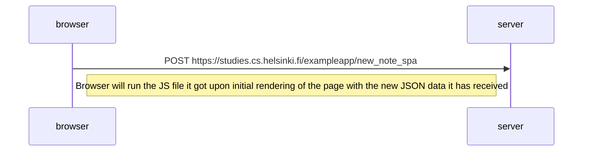

```mermaid
sequenceDiagram
    participant browser
    participant server

    browser->>server: POST https://studies.cs.helsinki.fi/exampleapp/new_note_spa

    Note right of browser: Browser will run the JS file it got upon initial rendering of the page with the new JSON data it has received
```
